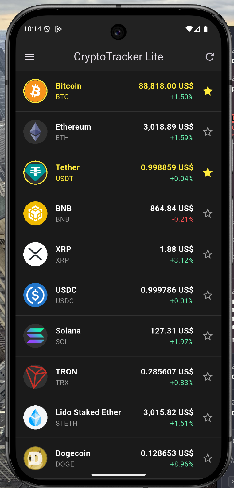
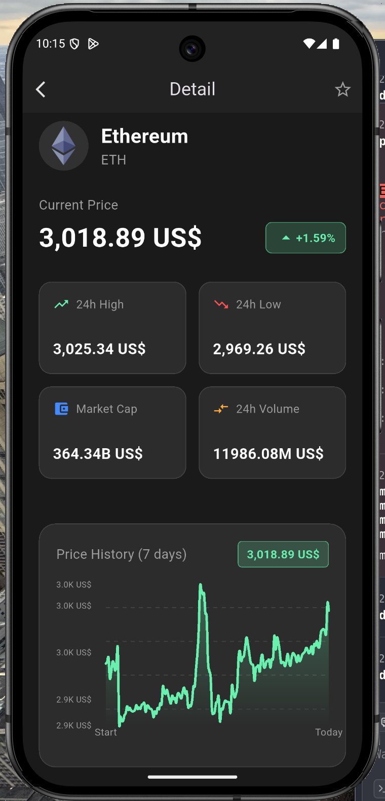
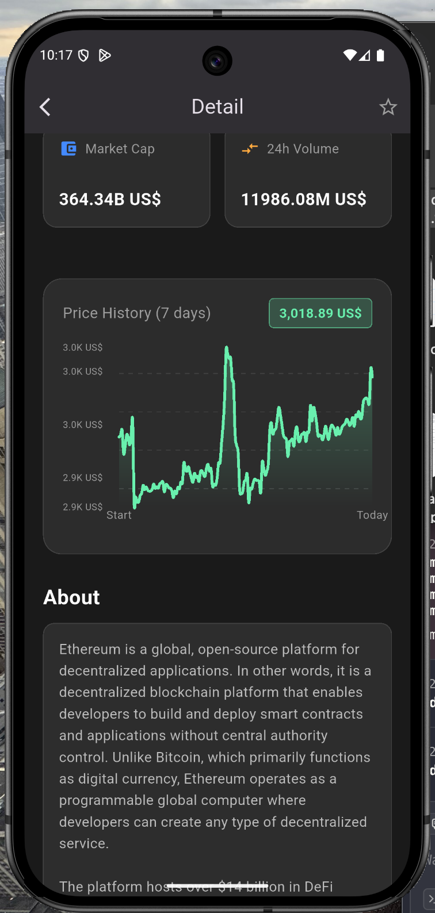
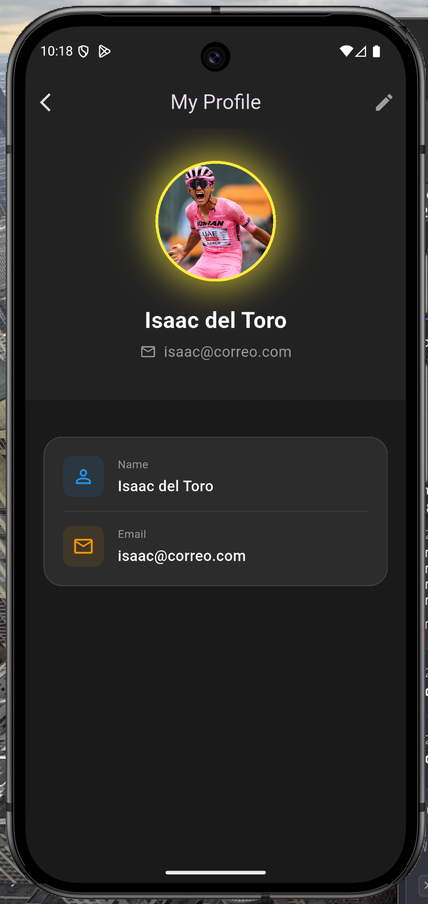

# CryptoTracker Lite 🚀

Una aplicación móvil desarrollada en **Flutter** que permite consultar información del mercado de criptomonedas en tiempo real, utilizando la API de CoinGecko.


## 📱 Características

- ✅ Lista de criptomonedas con precios en tiempo real
- ✅ Detalle de cada moneda con precio actual, máximo/mínimo 24h
- ✅ Gráfica interactiva de precios de los últimos 7 días
- ✅ Sistema de favoritos persistente
- ✅ Perfil de usuario (Isaac del Toro) con mail icon
- ✅ Modo oscuro con estética premium
- ✅ Soporte multi-idioma (Español, Inglés, Francés, Coreano)
- ✅ Configuración persistente (Idioma)
- ✅ Precios hardcodeados a USD con formato `[cantidad] US$`
- ✅ Caché en memoria para optimización
- ✅ Manejo de errores y rate limiting (HTTP 429)

## 🛠️ Requisitos Previos

- Flutter SDK 3.10.1 o superior
- Dart SDK 3.0 o superior
- Android Studio / Xcode (para emuladores)
- Git

## 🚀 Instalación y Ejecución

### 1. Clonar el repositorio

```bash
git clone https://github.com/raulmar0/crypto_tracker_lite.git
cd crypto_tracker_lite
```

### 2. Instalar dependencias

```bash
flutter pub get
```

### 3. Ejecutar la aplicación

```bash
# En modo debug
flutter run

# Para Android específicamente
flutter run -d android

# Para iOS específicamente
flutter run -d ios

# Para listar dispositivos disponibles
flutter devices
```

### 4. Build de producción

```bash
# Android APK
flutter build apk --release

# Android App Bundle
flutter build appbundle --release

# iOS
flutter build ios --release
```

## 🏗️ Arquitectura

La aplicación sigue una **arquitectura modular basada en BLoC** (Business Logic Component), con separación clara de responsabilidades.

### Estructura del Proyecto

```
lib/
├── api/                    # Servicios de API
│   └── coingecko_api_service.dart
├── logic/                  # BLoCs (lógica de negocio)
│   ├── crypto_list_bloc.dart
│   ├── favorites_bloc.dart
│   └── settings_bloc.dart
├── l10n/                   # Internacionalización (L10n)
│   ├── app_localizations.dart
│   ├── app_localizations_en.dart
│   ├── app_localizations_es.dart
│   ├── app_localizations_fr.dart
│   └── app_localizations_ko.dart
├── models/                 # Modelos de datos
│   └── crypto_model.dart
├── pages/                  # Pantallas de la app
│   ├── home_page.dart
│   ├── coin_detail_page.dart
│   ├── favorites_page.dart
│   ├── profile_page.dart
│   ├── settings_page.dart
│   └── error_page.dart
├── providers/              # Inyección de dependencias
│   └── app_providers.dart
├── services/               # Servicios locales
│   └── local_storage_service.dart
├── widgets/                # Widgets reutilizables
│   ├── crypto_list_tile.dart
│   ├── custom_drawer.dart
│   └── rate_limit_banner.dart
└── main.dart               # Punto de entrada
```

### Flujo de Datos

```
┌─────────────┐    ┌─────────────┐    ┌─────────────┐
│     UI      │◄───│    BLoC     │◄───│   Service   │
│   (Pages)   │    │   (Logic)   │    │    (API)    │
└─────────────┘    └─────────────┘    └─────────────┘
       │                  │                   │
       │    Events        │     HTTP          │
       └──────────────────►     Requests      │
                          │                   │
                          │    States         │
       ◄──────────────────┘                   │
```

### Capas de la Arquitectura

#### 1. **Capa de Presentación** (`pages/`, `widgets/`)
- Pantallas y widgets de UI
- Consumen estados de los BLoCs
- Disparan eventos hacia los BLoCs
- No contienen lógica de negocio

#### 2. **Capa de Lógica de Negocio** (`logic/`)
- Implementación de BLoCs con Events y States
- `CryptoListBloc`: Maneja la lista de criptomonedas
- `FavoritesBloc`: Maneja el sistema de favoritos
- `SettingsBloc`: Maneja la configuración (Idioma)

#### 3. **Capa de Datos** (`api/`, `services/`)
- `CoinGeckoApiService`: Llamadas a la API con caché
- `LocalStorageService`: Persistencia con SharedPreferences

#### 4. **Capa de Modelos** (`models/`)
- `CryptoModel`: Representa una criptomoneda

### Gestión de Estado con BLoC

```dart
// Events: Acciones del usuario
abstract class CryptoListEvent {}
class LoadCryptos extends CryptoListEvent {}
class RetryCryptos extends CryptoListEvent {}

// States: Estados de la UI
abstract class CryptoListState {}
class CryptoListInitial extends CryptoListState {}
class CryptoListLoading extends CryptoListState {}
class CryptoListLoaded extends CryptoListState {}
class CryptoListError extends CryptoListState {}
```

### Inyección de Dependencias

Se utiliza `Provider` (a través de `RepositoryProvider`) para inyectar las dependencias:

```dart
MultiRepositoryProvider(
  providers: [
    RepositoryProvider<LocalStorageService>.value(value: localStorage),
    RepositoryProvider<CoinGeckoApiService>.value(value: apiService),
  ],
  child: MultiBlocProvider(
    providers: [
      BlocProvider<FavoritesBloc>(...),
      BlocProvider<CryptoListBloc>(...),
    ],
    child: MyApp(),
  ),
)
```

## 🔌 API Utilizada

**CoinGecko API** (sin autenticación)

| Endpoint | Descripción |
|----------|-------------|
| `/coins/markets?vs_currency=usd` | Lista de criptomonedas |
| `/coins/{id}/market_chart?vs_currency=usd&days=7` | Historial de precios 7 días |
| `/coins/{id}` | Detalles y descripción |

## ⚡ Optimizaciones

### Caché en Memoria
- Los resultados de la API se cachean por **15 segundos**
- Evita peticiones redundantes al navegar

### Manejo de Rate Limiting (HTTP 429)
- Detección automática del error 429
- Banner visual con cuenta regresiva
- Espera obligatoria de **7 segundos** antes de reintentar
- Botón de reintento deshabilitado durante la espera

## 📦 Dependencias Principales

| Paquete | Uso |
|---------|-----|
| `flutter_bloc` | Gestión de estado |
| `provider` | Inyección de dependencias |
| `http` | Peticiones HTTP |
| `shared_preferences` | Persistencia local |
| `fl_chart` | Gráficas |
| `cached_network_image` | Caché de imágenes |
| `intl` | Formateo de moneda |
| `google_fonts` | Tipografía |

## 📸 Screenshots

| Lista | Detalle (1) | Detalle (2) | Perfil |
| :---: | :---: | :---: | :---: |
|  |  |  |  |

## 🎬 Demo
https://youtu.be/T5FXkl7r4Ug

